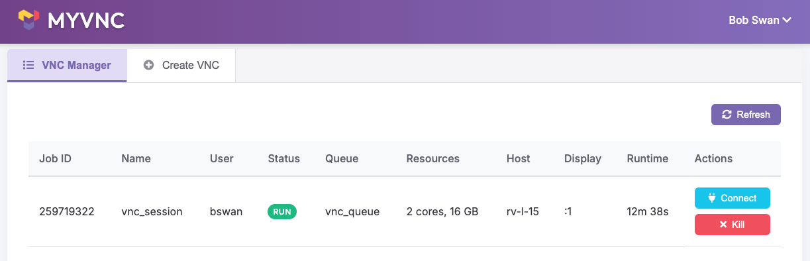
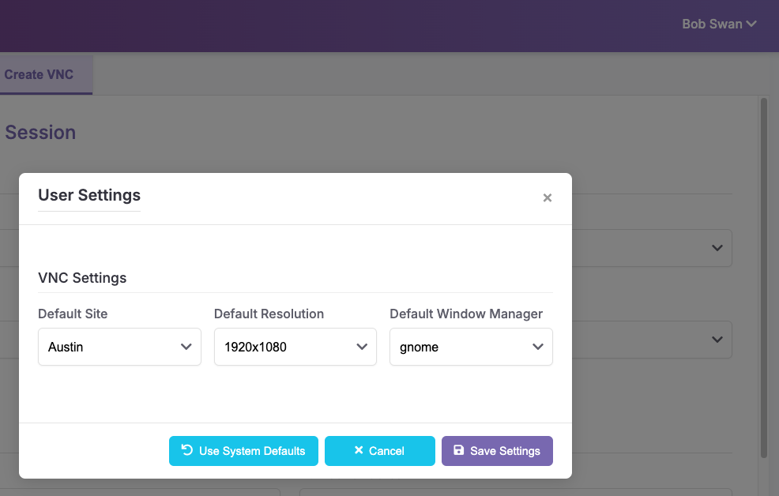

# myvnc
This is a web based application to manage a users VNCs.
There is a lightweight backend web server that supports this application via python CGI code.
There is also an included python command line wrapper script which makes curl calls to perform all operations available via the web interface.
It uses a minimal amount of packages to keep dependency requirements small.
In order to reduce the amount of required packages, all calls to LSF are made by the command line rather than the LSF API
It is fully Open Source via the Apache License 2.0

## Features
- There is a tab with a visual listing of active VNC servers, with the ability to open or kill each one
  - Each VNC submitted to LSF by the user is listed based on its name and site
- There is a tab to support the creation of a new VNC server
  - New VNCs can be opened with a variety of options including name, site, resolution, and window manager of choice.
    - There are default values for these VNC settings, but the user is able to change them via the GUI
    - Default VNC settings are defined in an included json file called config/vnc_config.json
- VNC commands are not executed directly, but rather submitted to LSF via the command line. Therefore neither python-vnc-client nor lsf-python-api packages are required.
  - LSF configuration to define the queue, number of cores, and amount of memory to reserve for submission. There are default values for these 3 LSF definitions, but the user is able to change them via the GUI
  - This script uses the LSF command line tools to interact with an LSF cluster.
  - Default LSF settings are defined in an included json file called config/lsf_config.json
  - The LSF environment file path can be configured in config/_defaultlsf_config.json to ensure LSF commands are available
- Server management functionality with start, stop, restart, and status operations
  - Provides a robust way to control the server process
  - Includes status reporting with uptime and connection details
  - Handles process management safely with proper cleanup
- Fully configurable SSL support. Disabled by default, enabled via configuration
- Fully configurable Authentication support. Disabled by default, LDAP or Entra enabled via configuration
- Manual port assignment for efficient VNC server connection
  - Automatically assigns a random display number (between 500-999) during VNC server creation
  - Includes fallbacktofreeport option to ensure successful VNC server startup
  - Optimizes connection process by detecting display numbers from the bjobs command output
  - Reduces SSH calls by extracting display numbers directly from commands when possible

## Getting Started

### Prerequisites

- Python 3.6+
- VNC Server installed on your system
- LSF (Platform Load Sharing Facility) installed and configured

### Installation

1. Clone the repository
2. Install dependencies: `pip install -r requirements.txt`
3. Configure your server settings in `config/server_config.json`
4. Configure your LSF settings in `config/lsf_config.json`

## Configuration Options

### Configuration File Paths

The application provides multiple ways to specify configuration file locations:

1. **Command Line Arguments**:
   - `--config_dir`: Specify an alternative directory for all config files
   - `--server_config_file`: Specify an alternative path for server_config.json
   - `--vnc_config_file`: Specify an alternative path for vnc_config.json
   - `--lsf_config_file`: Specify an alternative path for lsf_config.json

2. **Environment Variables**:
   - `MYVNC_CONFIG_DIR`: Specify an alternative directory for all config files
   - `MYVNC_SERVER_CONFIG_FILE`: Specify an alternative path for server_config.json
   - `MYVNC_VNC_CONFIG_FILE`: Specify an alternative path for vnc_config.json
   - `MYVNC_LSF_CONFIG_FILE`: Specify an alternative path for lsf_config.json

3. **Default Locations**:
   - These are used if no command line arguments or environment variables are provided
   - Default paths are relative to the application installation directory: `config/server_config.json`, etc.

Priority order when resolving configuration files:
1. Command line arguments (highest priority)
2. Environment variables
3. Default paths (lowest priority)

Example usage:
```bash
# Using environment variables
export MYVNC_CONFIG_DIR=/path/to/custom/config
./manage.py start

# Using command line arguments
./manage.py --server_config_file=/path/to/custom/server_config.json start

# Using CLI arguments with run_server.py
./run_server.py --config_dir=/path/to/custom/config --port=9144
```

## Server Management

The `manage.py` script provides several commands to control the server:

1. Start the server:
   ```bash
   ./manage.py start
   ```

2. Stop the server:
   ```bash
   ./manage.py stop
   ```

3. Restart the server:
   ```bash
   ./manage.py restart
   ```

4. Get server status:
   ```bash
   ./manage.py status
   ```

The status command displays information about the running server, including:
- PID (Process ID)
- Host and port
- URL to access the application
- Log directory and current log file
- Uptime information

## Usage

### GUI Application
To launch the graphical user interface, navigate your webpage to the url
```url
http://aus-misc:9143/
```

#### Screenshots
- VNC Manager tab showing a running VNC with connection details  

- Create VNC tab showing various VNC and LSF options  

- User Settings modal showing various options  


### Command Line Interface
The application also provides a command-line interface for managing VNC sessions:

1. List all active VNC sessions:
   ```bash
   myvnc-cli list
   ```

2. Create a new VNC session:
   ```bash
   myvnc-cli create --name my_session --resolution 1920x1080 --wm gnome --queue interactive --cores 2 --memory 16
   ```

3. Kill a VNC session:
   ```bash
   myvnc-cli kill <job_id>
   ```

## Logging

The server logs all activity to both stdout and log files. Log files are stored in the `logs` directory by default.
System commands are logged with a standardized format to help with debugging and troubleshooting.

## Contributing
We welcome contributions! To contribute:
1. Fork the repository.
2. Create a new branch for your feature or bugfix:
   ```bash
   git checkout -b feature-name
   ```
3. Commit your changes and push the branch:
   ```bash
   git commit -m "Description of changes"
   git push origin feature-name
   ```
4. Open a pull request.

Note: This project is in active use and is regularly being contributed to so I expect to be extremely responsive with PR requests. If you are willing and able to build support for SLURM (as opposed to the current LSF implementation), that would be fast tracked.

## License
This project is licensed under the Apache License 2.0. See the [LICENSE](LICENSE) file for details.
